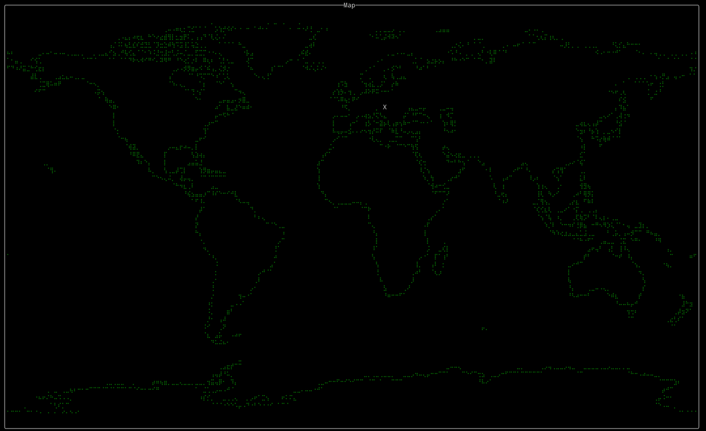

# gps-tui



A simple TUI world map for `gpsd` written in Rust with [rataui](https://github.com/ratatui-org/ratatui) and [crossterm](https://github.com/crossterm-rs/crossterm), based on [this template](https://github.com/ratatui-org/rust-tui-template). A white `X` marks the spot your gpsd is reporting.

## Usage

```bash
cargo run --release
```

## Building

```bash
cargo build
```

## Why?

The ADS-B receiver powering [hotelalpha.hu](https://balint.click/hotelalpha) is running on a Raspberry Pi 3B+ with a USB GPS module attached. I wanted to see if I could get a simple world map to display on the Pi's screen. With the ultimate goal of feeding the site from multiple receivers and with multiple datasources, I wanted to ensure a receiver is location-aware, hence the GPS module. With multiple datasources I'll be able to measure effectiveness of different antennas and receiver locations, without having to hardcode location coordinates.

Rust rocks. My rust sucks. I'm learning. Pull requests welcome to make this better.